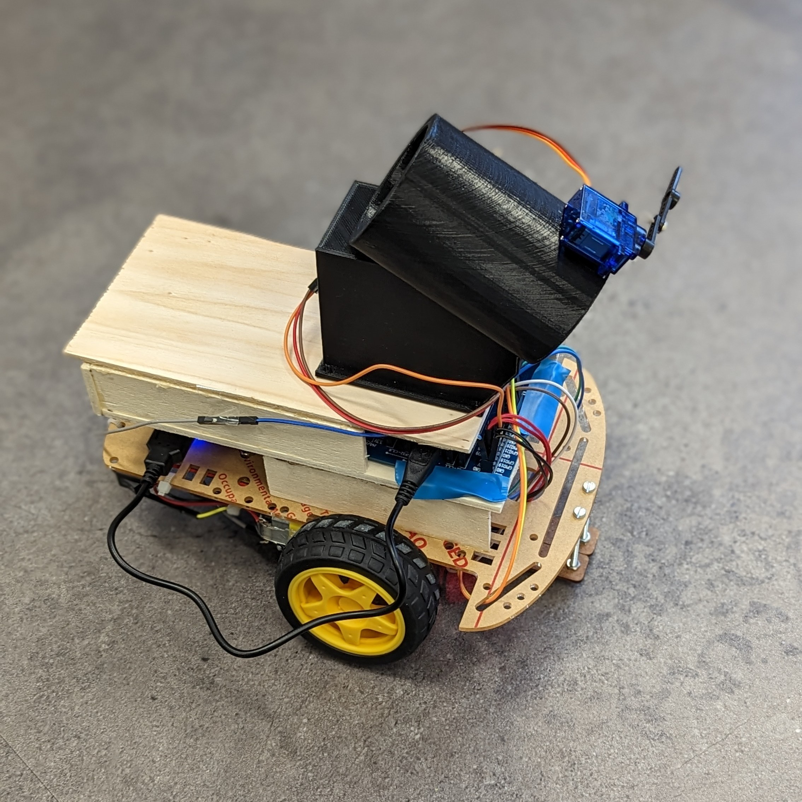
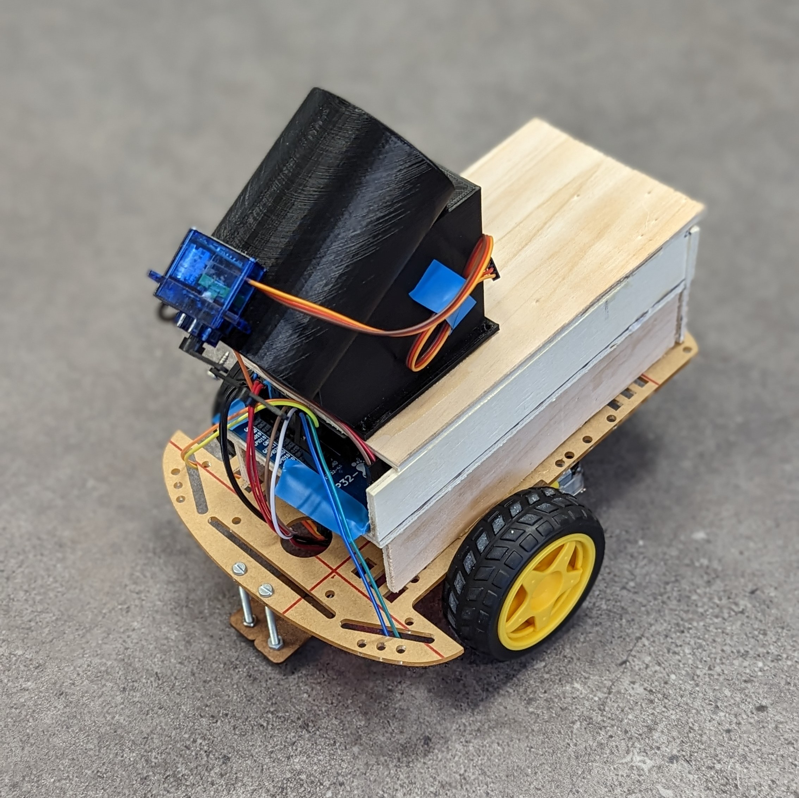

# ESPHSNR2022-23
Das Erstsemesterprojekt für den Studiengang Informatik der Hochschule Niederrhein im Wintersemester 2022/23.

Contributer: [Alexander](https://github.com/KuiperBlue), [Chris](https://github.com/ImChri2) und [Lukas](https://github.com/derLesh)

⭐️ Bewertung: 14/∞ Punkte

---

---

### Libraries
Alle Libraries sind in der "platformio.ini" zu finden und werden beim ersten Build automatisch von PlatformIO heruntergeladen.

- adafruit/Adafruit BMP280 Library@^2.6.6
- adafruit/Adafruit GFX Library@^1.11.3
- adafruit/Adafruit SSD1306@^2.5.7
- freenove/Freenove WS2812 Lib for ESP32@^1.0.5
- adafruit/Adafruit MCP4725@^2.0.0
- adafruit/Adafruit BusIO@^1.14.0
- adafruit/Adafruit Unified Sensor@^1.1.6
- Wire
- SPI
- madhephaestus/ESP32Servo@^0.12.1

---

## Installation über PlatformIO
1. PlatformIO installieren
    - [PlatformIO](https://platformio.org/install/ide?install=vscode) als VSCode Extension installieren

2. Projekt klonen

3. Projekt öffnen
- In PlatformIO über "Open Project" das Projekt öffnen

### Compilieren mit PlatformIO
In VSCode gibt es in der Status Bar mehrere Icons von PlatformIO. Mit dem Icon ✔ "Build" kann das Projekt kompiliert werden. Die Ausgabe wird in der Terminal Konsole angezeigt.

### Flashen mit PlatformIO
Mit dem Icon ➡ "Upload" kann das Projekt auf den ESP32 geflasht werden. Die Ausgabe wird in der Terminal Konsole angezeigt.
